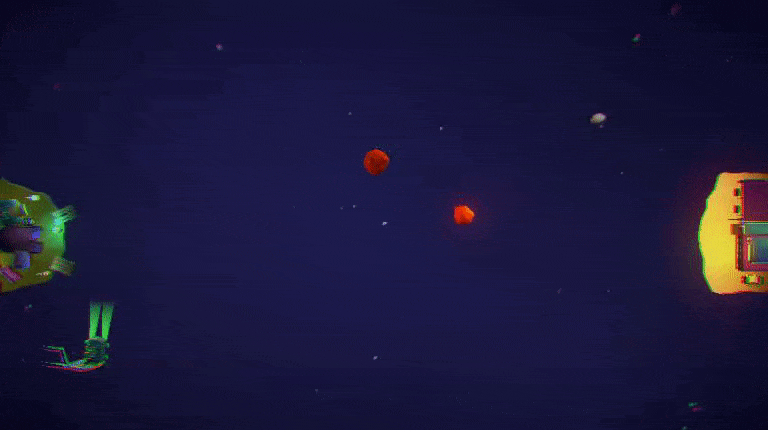
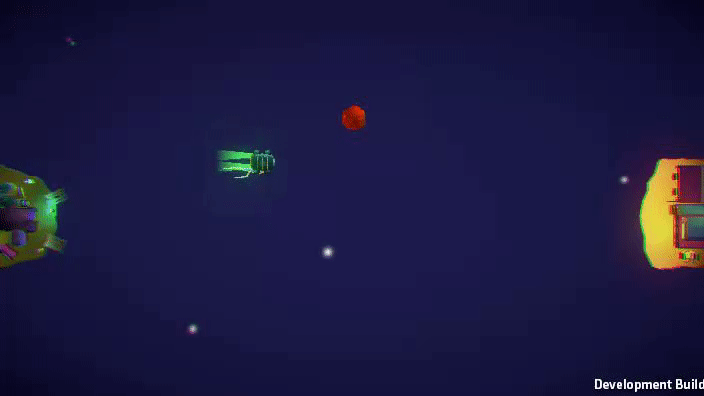

# AsterowaveAI
An attempt at making an AI for a jam game, using Unity ML-Agents

The original game can be downloaded [here](https://globalgamejam.org/2017/games/asterowave)

I stripped all unnecessary or too complicated features like bonuses etc, to make it simpler at first.

The ML-agents library isn't included in the repository.

### Progress :

I will update the progress here :

- Almost set up :

- First attempt at training, not so bad but still needs some tweaks and changes in the environment to speed up the training
  and have a more stable learning.
  

  
